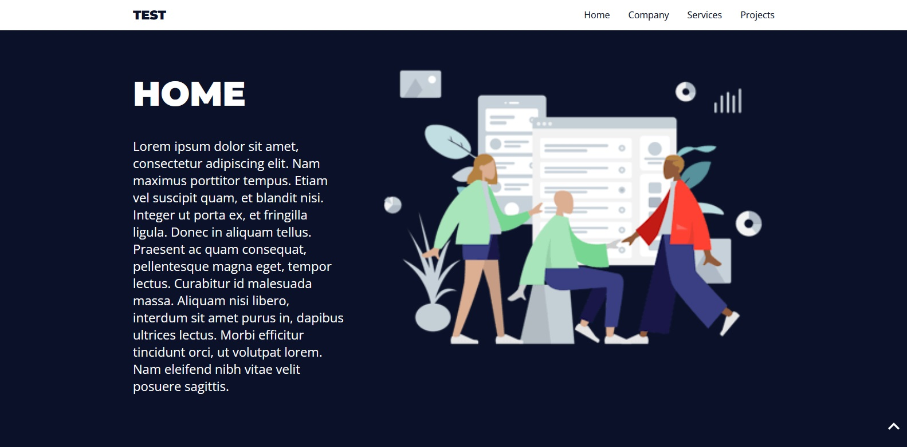

# 🛬 Landing Pages

Landing Pages é um projeto front-end desenvolvido em React que tem como objetivo gerar Single Page Applications (SPAs) dinâmicas e personalizadas com base em dados fornecidos por um backend construído com Strapi.

A aplicação consome os conteúdos via API RESTful fornecida pelo Strapi, permitindo que páginas sejam renderizadas de forma totalmente dinâmica e gerenciável. Isso facilita a criação de landing pages customizadas sem necessidade de modificações no código-fonte do front-end, já que toda a estrutura e conteúdo são definidos diretamente no painel administrativo do Strapi.

### ⚙️ Principais características:

* **SPA com React**: performance otimizada e navegação fluida.
* **Integração com Strapi**: consumo de dados estruturados (títulos, seções, imagens, formulários, etc.) via API.
* **Layout dinâmico**: componentes reutilizáveis e renderização condicional com base na estrutura vinda do backend.
* **Administração de conteúdo sem código**: voltado para times de marketing, vendas ou conteúdo que precisam criar páginas rapidamente.


### 🛠️ Tecnologias Utilizadas

* [React](https://react.dev/)
* [JavaScript](https://www.w3schools.com/js/js_es6.asp)
* [Storybook](https://storybook.js.org/)
* [Styled-components](https://styled-components.com/)

## 📄 Dependências e Versões Necessárias

Liste as dependências necessárias para rodar o projeto e as versões que você utilizou.

* React - Versão: 18.3.1
* Storybook - Versão: 8.4.7
* Styled-components - Versão: 6.1.13

## ✅ Como rodar o projeto 

Para executar a aplicação corretamente, é necessário seguir os seguintes passos:

1. [Configurar o Backend (Strapi)](https://github.com/bruno-cruz-oliveira/strapi-landing-pages): Antes de rodar o front-end, é obrigatório configurar o backend com o Strapi, pois toda a estrutura e o conteúdo das landing pages são consumidos a partir da API gerada por ele.

2. Instalar as dependências
    ```
    npm i
    ```

3. Inicie o servidor de desenvolvimento:
    ```
    npm start
    ```

4. Acesse no navegador através da url: http://localhost:3000



## 🧪 Como rodar os testes

O projeto utiliza duas abordagens complementares para garantir a qualidade dos componentes e da interface:

### Storybook – Testes Visuais

O Storybook é usado para desenvolver, visualizar e testar os componentes de forma isolada. Isso facilita o desenvolvimento desacoplado da aplicação e permite verificar como cada componente se comporta com diferentes dados (props).

**Como usar o Storybook**:
1. Inicie o Storybook:
    ```
    npm run storybook
    ```
2. Acesse no navegador: http://localhost:6006

### Testing Library – Testes Unitários e de Integração

A React Testing Library é utilizada para escrever testes automatizados com foco na experiência do usuário final. Ela permite validar se os componentes estão sendo renderizados corretamente, se os dados aparecem como esperado e se as interações funcionam.

**Como rodar os testes**:

1. Execute o comando:
    ```
    npm test
    ```
2. Para rodar testes com cobertura:
    ```
    npm test -- --coverage
    ```
3. Os arquivos de teste seguem a convenção NomeDoComponente.test.jsx e ficam na mesma pasta do componente.